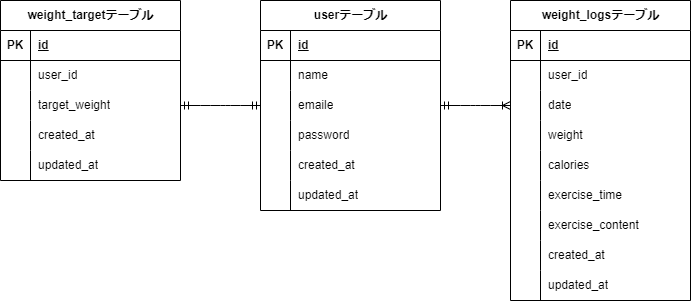

## アプリケーション名

PiGLy

## 環境構築

```
Dockerビルド

    1. git clone git@github.com:manami-neko/manami-kadai3.git
    2. コンテナ作成
       docker-compose up -d --build

＊MySQLはOSによって起動しない場合があるので、それぞれのPCに合わせてdocker-compose.ymlファイルを編集してください。

Laravel環境構築

    1.docker-compose exec php bash
    2.composer install
    3.env.exampleファイルから.evnを作成し、環境変数を変更
    cp .env.example .env
    4.php artisan key:generate
    5.php artisan migrate
    6.php artisan db:seed
    "The stream or file could not be opened"エラーが発生した場合
    srcディレクトリにあるstorageディレクトリ以下の権限を変更
    $ chmod -R 777 storage

```

## 使用技術

```
    ・php 7.4.9
    ・Laravel 8.83.8
    ・MySQL 8.0.26
```

## URL

```
    ・環境開発：http://localhost/
    ・phpMyAdmin：http://localhost:8080/
```

## ER 図


